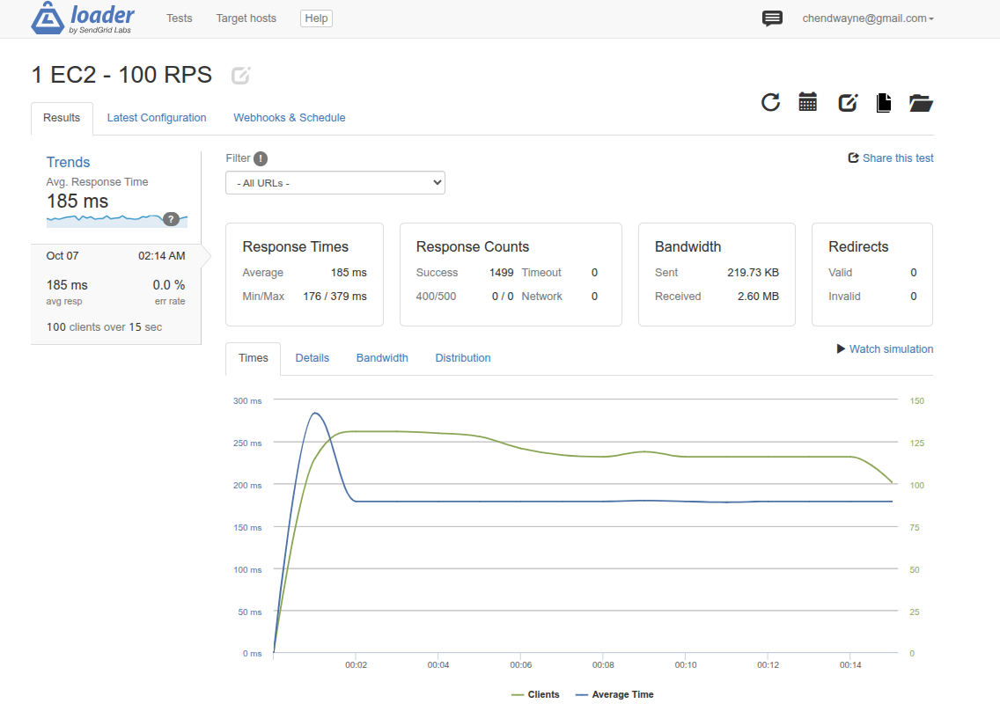
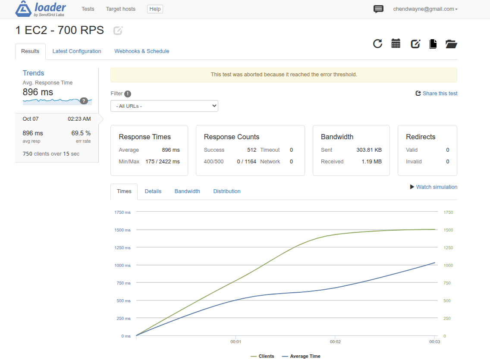
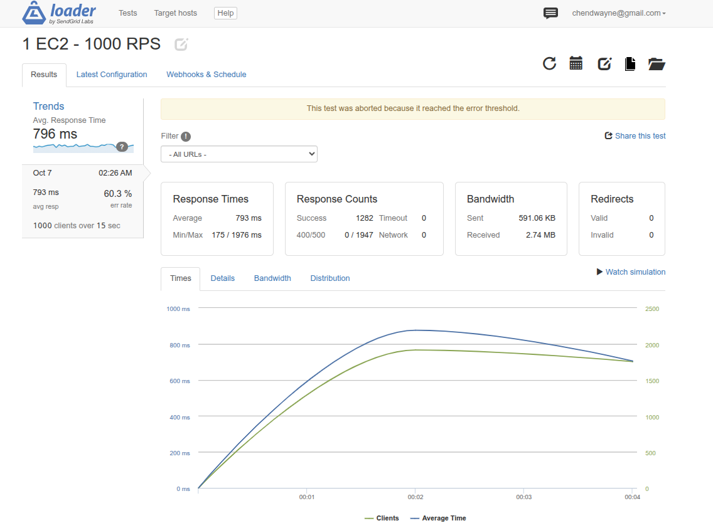
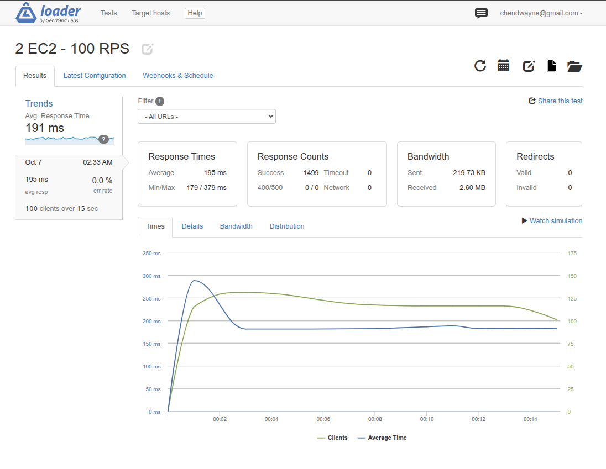
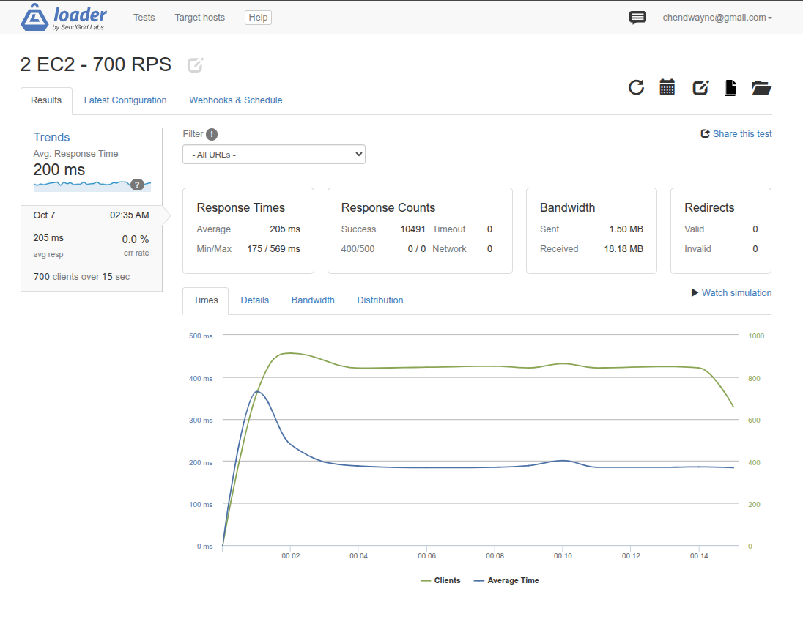
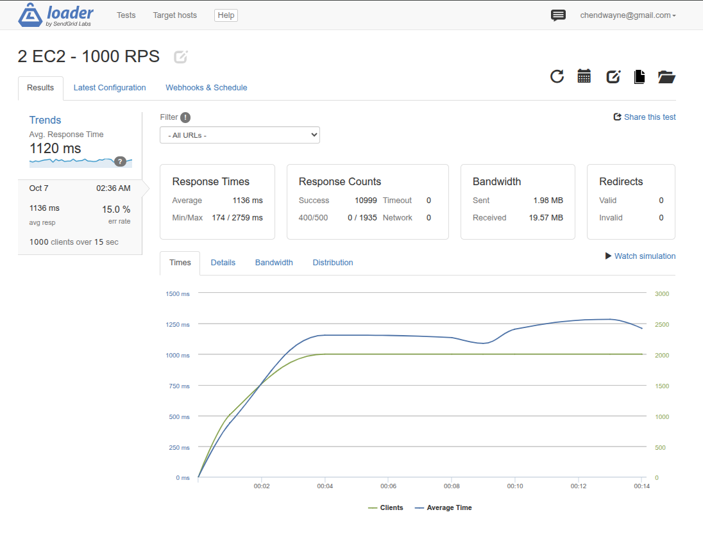

# 專案負載平衡 (Load Balancer) 壓力測試報告

本報告旨在測試與對比「單台 EC2」與「雙台 EC2 搭配 Application Load Balancer (ALB)」在不同流量壓力下的系統穩定度與乘載極限。

## 測試環境與參數設定
* **測試工具**：Loader.io
* **測試時長**：每組測試連續 15 秒 (Duration: 15s)
* **測試類型**：每秒固定併發請求 (Clients per second / RPS)
* **伺服器規格**：AWS EC2 `t3.micro` (搭配 Nginx + FastAPI)
* **測試級距**：100 RPS、700 RPS、1000 RPS

---

## 第一階段：單台 EC2 極限測試 (1 EC2)
測試目標為直接對單一台 EC2 進行壓力測試，找出單機的效能瓶頸。

### 1. 100 RPS (每秒 100 次請求)
* **結果**：✅ 測試通過
* **平均回應時間**：185 ms
* **錯誤率**：0% (Timeout: 0, 400/500: 0)
* **分析**：單台 `t3.micro` 在 100 RPS 的負載下表現游刃有餘，系統穩定無掉包。

### 2. 700 RPS (每秒 700 次請求)
* **結果**：❌ 測試中斷 (Aborted)
* **平均回應時間**：896 ms
* **錯誤率**：69.5% (產生 1164 次錯誤)
* **分析**：單台伺服器無法承受此壓力，測試在第 3 秒即觸發錯誤閥值被系統強制中斷，伺服器陷入崩潰狀態。

### 3. 1000 RPS (每秒 1000 次請求)
* **結果**：❌ 測試中斷 (Aborted)
* **平均回應時間**：793 ms
* **錯誤率**：60.3% (產生 1947 次錯誤)
* **分析**：與 700 RPS 狀況相同，系統瞬間超載並拒絕連線，單機效能天花板明顯低於此數值。

---

## 第二階段：雙台 EC2 + ALB 分流測試 (2 EC2s)
啟用 AWS ALB，並將流量平均分發至兩台位於不同可用區域 (AZ) 的 EC2 實例。

### 1. 100 RPS (每秒 100 次請求)
* **結果**：✅ 測試通過
* **平均回應時間**：195 ms
* **錯誤率**：0%
* **分析**：在輕度負載下，雙機架構與單機架構表現同樣平穩。

### 2. 700 RPS (每秒 700 次請求) - 🌟 顯著改善
* **結果**：✅ 測試通過 (未中斷)
* **平均回應時間**：205 ms
* **錯誤率**：0% (Success: 10491 次)
* **分析**：**這是 ALB 橫向擴展威力的最佳證明！** 原本在單機測試中直接崩潰的 700 RPS，在雙機分流下，不僅成功撐完 15 秒，錯誤率更降至 0%，且平均回應時間維持在極佳的 205 ms。

### 3. 1000 RPS (每秒 1000 次請求)
* **結果**：⚠️ 測試完成 (達效能極限)
* **平均回應時間**：1136 ms
* **錯誤率**：15.0% (產生 1935 次錯誤)
* **分析**：雖然在 1000 RPS 時出現了 15% 的錯誤率，且回應時間拉長，但**測試並未像單機時被強制中斷**，系統仍成功處理了近 11000 次請求。這顯示雙機架構極大地提升了系統的容錯率與存活時間。

---

## 結論 (Conclusion)
透過本次 Loader.io 壓力測試，驗證了引入 **Application Load Balancer (ALB)** 與 **橫向擴展 (Scale-out)** 架構的必要性。

當系統面臨突發性高流量 (如 700 RPS) 時，單機架構會瞬間癱瘓導致服務中斷 (Downtime)；而雙機負載平衡架構則能將壓力平均分散，在不升級單台主機硬體規格 (Scale-up) 的前提下，完美維持 0% 錯誤率的高可用性 (High Availability) 服務品質。